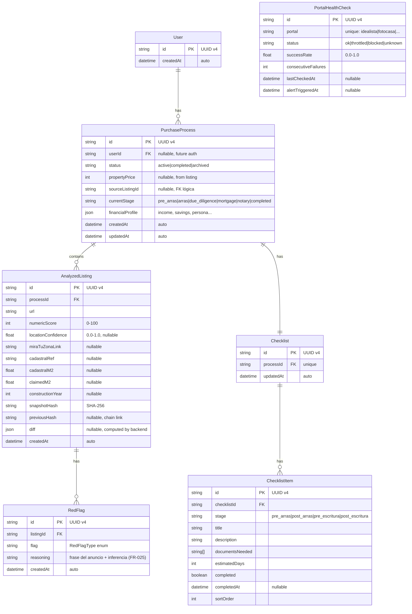
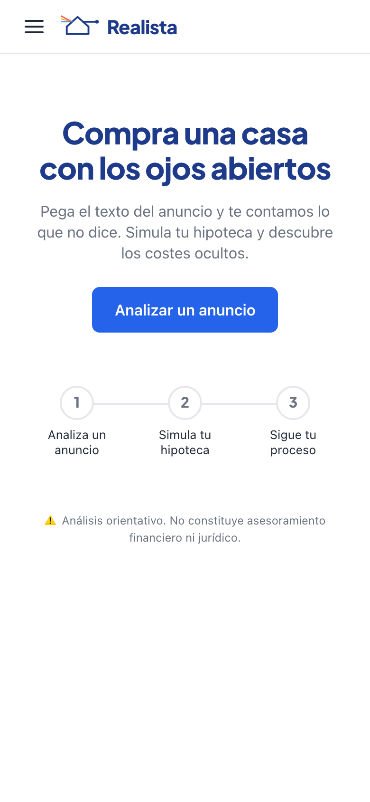
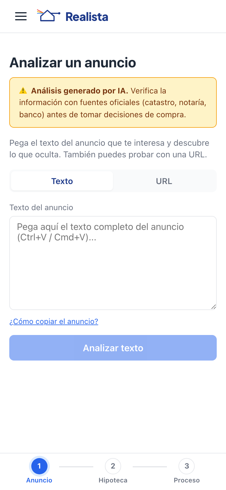
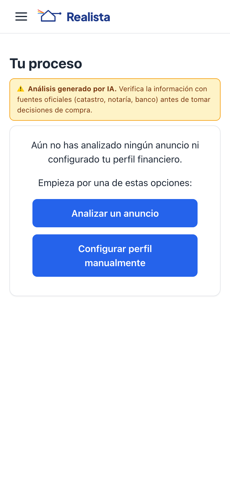
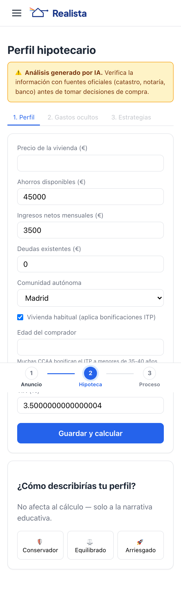
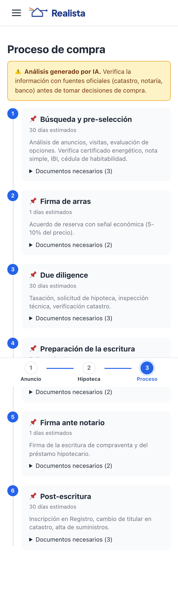

## Índice

0. [Ficha del proyecto](#0-ficha-del-proyecto)
1. [Descripción general del producto](#1-descripción-general-del-producto)
2. [Arquitectura del sistema](#2-arquitectura-del-sistema)
3. [Modelo de datos](#3-modelo-de-datos)
4. [Especificación de la API](#4-especificación-de-la-api)
5. [Historias de usuario](#5-historias-de-usuario)
6. [Tickets de trabajo](#6-tickets-de-trabajo)
7. [Pull requests](#7-pull-requests)
8. [AI Engineering Setup](#8-ai-engineering-setup)
9. [Capturas del sistema](#9-capturas-del-sistema)

---

## 0. Ficha del proyecto

### **0.1. Tu nombre completo:**

Daniel Miguel Margenta

### **0.2. Nombre del proyecto:**

Realista

### **0.3. Descripción breve del proyecto:**

Asistente educativo con IA para compradores primerizos de vivienda en España. Analiza anuncios inmobiliarios con LLM para destapar lenguaje manipulador y omisiones, cruza datos con el Catastro, calcula los gastos ocultos de compra (que ningún banco te explica), y simula estrategias de amortización vs inversión basadas en tu perfil personal. PWA mobile-first, sin consejo financiero — solo transparencia.

### **0.4. URL del proyecto:**

> Desplegado en Railway:
> - **Frontend PWA:** `https://realista.up.railway.app`
> - **Backend API:** `https://realista-api.up.railway.app`
>
> **Instrucciones locales:** El proyecto es 100% funcional en local con `docker compose up -d && npm install && npm run db:migrate -w backend && npm run dev`. Ver [Despliegue](#29-despliegue-en-railway) para instrucciones de deploy. Si necesitas desplegar tu propia instancia, consulta la sección de despliegue.

### 0.5. URL o archivo comprimido del repositorio

`https://github.com/dmiguelm/AI4Devs-finalproject-DMM` (rama `finalproject-DMM` para la Entrega Final)

---

## 1. Descripción general del producto

### **1.1. Objetivo:**

Acompañar al comprador primerizo de vivienda en España con tres herramientas que cubren sus principales puntos ciegos:

1. **Listing Lens** — Analiza anuncios inmobiliarios con IA (OpenRouter) para detectar lo que el anuncio no te cuenta: lenguaje ambiguo, metros inflados, ubicación imprecisa, ausencia de certificado energético. Cruza la ubicación estimada con el Catastro para verificar los datos declarados.

2. **Mortgage Compass** — Calcula los gastos ocultos de compra (ITP/IVA, notaría, registro, gestoría, tasación) — ese 10-12% adicional que nadie te explica. Construye un perfil financiero personal y muestra estrategias de amortización voluntaria (sin amortizar, ligera, moderada, agresiva) comparadas con una alternativa de inversión a largo plazo. Todo con narrativa educativa, nunca prescriptiva.

3. **Dashboard** — Panel de seguimiento con historial de anuncios analizados, instantánea financiera y acceso rápido a todas las herramientas. Detección de cambios al re-analizar un anuncio (diff de snapshots).

**Público objetivo:** Compradores primerizos de vivienda en España que quieren entender lo que compran y lo que pagan, sin depender exclusivamente de lo que les cuentan inmobiliarias y bancos.

### **1.2. Características y funcionalidades principales:**

| Funcionalidad | Descripción | Prioridad |
|---------------|-------------|-----------|
| Listing Lens | Pegar URL de anuncio → análisis LLM + cruce catastral → puntuación + banderas rojas + **razonamiento por cada flag** (AI Reasoning Transparency) | 🥇 Must-Have |
| Mortgage Compass | Perfil financiero → gastos ocultos → simulador de amortización vs inversión → narrativa educativa + **gráfico visual** comparativo | 🥇 Must-Have |
| Dashboard | Historial de análisis, perfil financiero, **vista agregada en 1 llamada**, **diff de re-análisis**, acceso a herramientas | 🥇 Must-Have |
| **Negotiation Assistant** | Tras el análisis, genera **5-8 preguntas concretas** para hacer al inmobiliario, basadas en las red flags detectadas | 🔶 Should-Have |
| Proceso de compra | Cronograma visual con hitos + checklist documental por etapa. Progreso por fase, documentos necesarios, fechas estimadas | 🔶 Should-Have |

### **1.3. Diseño y experiencia de usuario:**

Interfaz mobile-first (375px+) desarrollada con SvelteKit. PWA instalable con navegación por tabs — cada herramienta accesible independientemente, sin wizard forzado. Componentes clave: Header con logo, ProcessStepper (etapas del proceso de compra), AIDisclaimer persistente, AmortizationVsInvestmentChart (gráfico side-by-side), DiffBadge (cambios al re-analizar), NegotiationPoints (preguntas accionables), RedFlagCard (flags con reasoning del LLM). Principios UX: mobile-first (375px+), PWA instalable, navegación por pestañas, sin wizard forzado — cada herramienta accesible independientemente.

### **1.4. Instrucciones de instalación:**

> **Estado actual (Entrega Final):** el proyecto está completo y funcional, desplegado en Railway. Ver la [sección 8](#8-ai-engineering-setup) para el detalle de los componentes de IA y [`.opencode/harness/run-locally.md`](.opencode/harness/run-locally.md) para el setup paso a paso.

**Quickstart:**

```bash
# 1. Clonar y entrar en la rama
git clone https://github.com/dmiguelm/AI4Devs-finalproject-DMM.git
cd AI4Devs-finalproject-DMM
git checkout finalproject-DMM

# 2. Configurar entorno
cp .env.example .env
# Editar .env con tu OPENROUTER_API_KEY (https://openrouter.ai/keys)

# 3. Arrancar PostgreSQL
docker compose up -d

# 4. Instalar dependencias
npm install                  # raíz (orquesta backend + frontend)
(cd backend && npm install)
(cd frontend && npm install)

# 5. Migrar BD y sembrar
(cd backend && npx prisma migrate dev)
(cd backend && npm run db:seed)

# 6. Arrancar dev (backend en :3001, frontend en :5173)
npm run dev
```

Stack: SvelteKit (PWA) + Node.js/Express + TypeScript + PostgreSQL + Prisma + OpenRouter (LLM) + Nominatim (geocoding) + API Catastro + Vitest + Playwright.

---

## 2. Arquitectura del Sistema

### **2.1. Diagrama de arquitectura:**

```
┌─────────────────────────────────────────────────────────────┐
│                     DOMINIO (sin dependencias)               │
│                                                              │
│  Agregados: User, PurchaseProcess, AnalyzedListing,         │
│             Checklist, RedFlag, ChecklistItem                │
│                                                              │
│  Puertos: ListingAnalyzerPort, LocationResolverPort,        │
│           CatastroPort, MortgageCalculatorPort,              │
│           NotificationPort                                   │
│                                                              │
│  Value Objects: TransparencyScore, FinancialProfile,        │
│                 RedFlags, BureaucraticMilestone,             │
│                 Coordinates, SnapshotHash, HiddenCosts,      │
│                 NegotiationPoint                             │
└─────────────────────────────────────────────────────────────┘
                             │
┌────────────────────────────┼────────────────────────────────┐
│                 INFRAESTRUCTURA (adaptadores)                │
│                                                              │
│  OpenRouterAdapter        → LLM gateway (análisis semántico) │
│  CheerioAdapter           → HTML parsing server-side         │
│  GeocodingAdapter         → Nominatim OSM (coordenadas GPS)  │
│  CatastroAdapter          → API Sede Electrónica del Catastro│
└─────────────────────────────────────────────────────────────┘

┌──────────┐     ┌──────────────────┐     ┌──────────────────┐
│  Usuario  │────▶│  Realista PWA     │────▶│  Backend API      │
│  (móvil)  │     │  (SvelteKit+PWA)  │     │  (Node.js/Express)│
└──────────┘     └──────────────────┘     └────────┬─────────┘
                                                    │
               ┌──────────────────────┼──────────┐
               │                      │          │
          ┌────▼─────┐         ┌──────▼───────┐
          │ PostgreSQL │         │ OpenRouter   │
          │ (datos)    │         │ (LLM)        │
          └───────────┘         └──────────────┘
```

**Patrón:** Arquitectura Hexagonal (Puertos y Adaptadores) + DDD táctico.

**Justificación:** El dominio contiene cero dependencias de frameworks. Express, Prisma, SvelteKit viven en la capa de infraestructura. Esto permite testear la lógica de negocio de forma aislada, cambiar la base de datos o el framework frontend sin tocar el dominio, y mantener una separación clara entre lo que hace el sistema y cómo lo hace.

**Beneficios:** Testabilidad, mantenibilidad, independencia de frameworks, alineación con DDD para el vocabulario del dominio inmobiliario español.

**Sacrificios:** Más boilerplate inicial. Para un MVP con 3 features, la estructura hexagonal añade directorios pero garantiza que el proyecto escale sin reescrituras.

### **2.2. Descripción de componentes principales:**

| Componente | Tecnología | Función |
|------------|-----------|---------|
| Frontend | SvelteKit + Vite + @vite-pwa/sveltekit | SPA mobile-first instalable. Server-side loaders proxy al backend |
| Backend | Node.js + Express + TypeScript | API REST con arquitectura hexagonal. Dominio sin dependencias |
| Base de datos | PostgreSQL + Prisma ORM | Persistencia relacional. Migraciones gestionadas por Prisma |
| Análisis IA | OpenRouter (LLM gateway) | System prompt estructurado para detectar banderas rojas en anuncios. Sin fallback numérico — si el LLM falla, se ofrece pegar texto manual |
| HTML parsing | Cheerio | Extracción server-side del texto del anuncio. Fallback a subdominio `.m.` |
| Catastro | API Sede Electrónica del Catastro | Cruce de m² declarados vs oficiales, año de construcción |
| Testing | Vitest + Playwright | Unitarios + integración + E2E del flujo principal |

### **2.3. Descripción de alto nivel del proyecto y estructura de ficheros**

```
backend/
├── src/
│   ├── domain/           # Lógica de dominio pura (sin dependencias externas)
│   │   ├── aggregates/   # User, PurchaseProcess, AnalyzedListing, Checklist
│   │   ├── value-objects/# TransparencyScore, FinancialProfile, RedFlags...
│   │   ├── ports/        # Interfaces (ListingAnalyzerPort, CatastroPort...)
│   │   └── services/     # Casos de uso (AnalyzeListingUseCase...)
│   ├── adapters/         # Implementaciones de puertos
│   │   ├── openrouter/   # OpenRouterAdapter (análisis LLM)
│   │   ├── cheerio/      # CheerioAdapter (parseo HTML)
│   │   ├── location/     # GeocodingAdapter (Nominatim)
│   │   ├── catastro/     # CatastroAdapter (API catastral)
│   ├── api/              # Express routes, controllers, middleware
│   ├── infrastructure/   # Prisma schema, config, constants
│   └── index.ts
└── tests/                # Unitarios + integración

frontend/
├── src/
│   ├── routes/           # SvelteKit file-based routing
│   │   ├── +page.svelte  # Landing
│   │   ├── mi-proceso/    # Dashboard / resumen de proceso
│   │   ├── listing-lens/ # Análisis de anuncios
│   │   ├── mortgage-compass/ # Simulador hipotecario
│   │   ├── timeline/     # Proceso de compra (cronograma + checklist unificado)
│   │   └── +layout.svelte
│   ├── lib/              # Stores, API client, utils
│   └── app.css
└── tests/

e2e/                      # Playwright end-to-end tests
specs/                    # Documentación SDD (spec-kit)
docs/                     # Constitución, ADRs y eventos de dominio
.specify/                 # Toolkit spec-kit (regenerable con 'specify init')
```

**Patrón:** Arquitectura Hexagonal + DDD táctico. Separación backend/frontend con E2E cross-stack.

### **2.4. Infraestructura y despliegue**

**CI/CD:** GitHub Actions operativo en `.github/workflows/ci.yml` — 3 jobs (backend, frontend, E2E) con PostgreSQL service. Pipeline: lint → typecheck → tests unitarios → coverage → hexagonal-check → E2E. Triggers en push y PR a `main` y `feature-entrega2-DMM`.

**Despliegue:** Railway — dos servicios Node.js (backend Express + frontend SvelteKit adapter-node) + PostgreSQL plugin. CI/CD con GitHub Actions operativo.

### **2.5. Seguridad**

- Sin autenticación en MVP. Sesiones anónimas identificadas por UUID v4 generado en servidor.
- Rate limiting: máximo 20 análisis/día por sesión.
- No se almacena contenido de terceros (HTML de anuncios, texto extraído). Solo resultados de análisis.
- User-Agent honesto: `Realista/1.0 (analizador educativo)`.
- Secrets gestionados vía variables de entorno, nunca en código.
- Sin datos personales ni PII almacenados.
- Campo `userId` nullable preparado para futura autenticación sin migración de datos.

### **2.6. Tests**

| Suite | Framework | Tests | Estado |
|-------|-----------|-------|--------|
| Backend (dominio + adaptadores + integración + contrato + middleware) | Vitest + supertest | 122 tests (27 files) | ✅ Todos pasando |
| Frontend (componentes + API + utilidades) | Vitest + happy-dom | 51 tests (12 files) | ✅ Todos pasando |
| E2E (full-flow + listing-lens + mortgage-compass + UX) | Playwright | 13 tests (4 flows) | ✅ Todos pasando |
| **Total** | | **186 tests** (43 files) | ✅ Todos pasando |

- **Backend dominio:** TransparencyScore, RedFlags, FinancialProfile, Coordinates, SnapshotHash, HiddenCosts, AmortizationCalculator, InvestmentCalculator, NarrativeGenerator, ChecklistTemplate, DiffService, AnalyzeListingUseCase (core + diff), PurchaseProcessAggregator, NegotiationPointsService. **Adaptadores:** CheerioAdapter (port + headers + retry), PlaywrightAdapter, ChainedFetchAdapter, BrowserPool, OpenRouterAdapter, xmlParser. **Middleware:** RateLimiter. **Integración:** Dashboard (estado vacío + activo) y Listings (analyze + validación + GET por id + negotiation-points). Cobertura configurada al 80% en capa de dominio.
- **Frontend:** componentes (Header, Logo, LandingHero, ProcessStepper, ListingTabs, LandingStepper, RedFlagCard, DiffBadge) + API client (streamingClient, crossModuleApiError) + utilidades (format, session). Entorno happy-dom. Cobertura configurada.
- **E2E:** full-flow (4 tests), listing-lens (1 test), mortgage-compass (2 tests), UX redesign (6 tests). Ejecutados con Playwright + Chromium.
- CI ejecuta `lint` → `typecheck` → `test:all` → `test:coverage` → `hexagonal-check` → `build` (backend + frontend) en cada push. El job E2E construye y arranca ambos servidores contra PostgreSQL antes de ejecutar Playwright.

### **2.7. Despliegue en Railway**

#### Arquitectura de despliegue

```
┌─────────────────────────────────────────────────────────┐
│                        Railway                          │
│                                                         │
│  ┌─────────────────────┐  ┌──────────────────────────┐ │
│  │ realista-api          │  │ realista                  │ │
│  │ (Node.js + Express)  │  │ (SvelteKit adapter-node) │ │
│  │ PORT=3001            │  │ PORT=3000                │ │
│  └──────────┬──────────┘  └──────────────────────────┘ │
│             │                                           │
│  ┌──────────▼──────────┐                               │
│  │ PostgreSQL 16       │  (Railway plugin)              │
│  │ DATABASE_URL        │                                │
│  └─────────────────────┘                               │
└─────────────────────────────────────────────────────────┘
```

#### Variables de entorno necesarias en Railway

| Variable | Servicio | Valor |
|----------|----------|-------|
| `DATABASE_URL` | realista-api | Automática (Railway PostgreSQL plugin) |
| `OPENROUTER_API_KEY` | realista-api | Tu API key de OpenRouter |
| `FRONTEND_URL` | realista-api | `https://realista.up.railway.app` |
| `NODE_ENV` | realista-api | `production` |
| `REALISTA_USER_AGENT` | realista-api | `Realista/1.0 (analizador educativo)` |
| `PLAYWRIGHT_ENABLED` | realista-api | `false` |
| `VITE_API_URL` | realista | `https://realista-api.up.railway.app` |

#### Comandos de build y start

**Backend (`realista-api`):**
- Build: `npm install && npx prisma generate && cd backend && npm run build && npx prisma migrate deploy`
- Start: `npm start -w backend`

**Frontend (`realista`):**
- Build: `npm install && cd frontend && npm run build`
- Start: `node frontend/build/index.js`

#### Pasos para desplegar

1. Subir el repo a GitHub (rama `finalproject-DMM`)
2. Crear proyecto en [Railway](https://railway.app) → "Deploy from GitHub repo"
3. Añadir PostgreSQL plugin
4. Crear servicio `realista-api` (Node.js):
   - Build: `npm install && npx prisma generate && cd backend && npm run build && npx prisma migrate deploy`
   - Start: `npm start -w backend`
   - Variables: `OPENROUTER_API_KEY`, `FRONTEND_URL=https://realista.up.railway.app`, `NODE_ENV=production`, `PLAYWRIGHT_ENABLED=false`
5. Crear servicio `realista` (Node.js):
   - Build: `npm install && cd frontend && npm run build`
   - Start: `node frontend/build/index.js`
   - Variables: `VITE_API_URL=https://realista-api.up.railway.app`
6. Railway asigna URLs automáticamente. Cada push a la rama conectada redeployea ambos servicios.

> **Nota:** Playwright está deshabilitado en Railway. Los portales con DataDome (Idealista, Fotocasa) requerirán pegar el texto del anuncio manualmente. Para desarrollo local con Playwright, `PLAYWRIGHT_ENABLED=true` en `.env` y `npx playwright install chromium`.

---

## 3. Modelo de Datos

### **3.1. Diagrama del modelo de datos:**



### **3.2. Descripción de entidades principales:**

**User**
- `id`: UUID v4, clave primaria
- `createdAt`: DateTime, autogenerado
- Sin email, contraseña ni datos personales en MVP
- Relación 1:N con PurchaseProcess

**PurchaseProcess**
- `id`: UUID v4, clave primaria
- `userId`: FK a User, nullable para soportar sesiones anónimas ahora y auth después
- `status`: String, valores: `active`, `completed`, `archived`
- `propertyPrice`: Int nullable, pre-rellenado desde el listing analizado (FR-015)
- `sourceListingId`: FK lógica al AnalyzedListing que inició el proceso
- `currentStage`: String, etapa actual del proceso (`pre_arras`, `arras`, `due_diligence`, `mortgage`, `notary`, `completed`)
- `financialProfile`: JSON (propertyPrice, savings, monthlyIncome, existingDebts, region, interestRate, persona)
- Relación 1:N con AnalyzedListing, 1:1 con Checklist

**AnalyzedListing**
- `id`: UUID v4, clave primaria
- `processId`: FK a PurchaseProcess
- `numericScore`: Int 0-100, puntuación de transparencia del anuncio
- `cadastralM2` / `claimedM2`: comparativa de superficie declarada vs oficial
- `snapshotHash`: SHA-256 del contenido del análisis para detección de cambios
- `previousHash`: enlace al hash del snapshot anterior (cadena de trazabilidad)
- `diff`: JSON con deltas vs snapshot anterior, computado por el backend en re-análisis (FR-022)
- Relación 1:N con RedFlag

**RedFlag** (normalizado, FR-028)
- `id`: UUID v4, clave primaria
- `listingId`: FK a AnalyzedListing
- `flag`: String (enum cerrado `RedFlagType`: `imprecise_location`, `no_energy_certificate`, `inflated_square_meters`, etc.)
- `reasoning`: String — frase del anuncio que disparó el flag + inferencia del LLM (FR-025)
- Permite queries SQL agregadas para análisis de producto futuro

**Checklist**
- `id`: UUID v4, clave primaria
- `processId`: FK única a PurchaseProcess
- Relación 1:N con ChecklistItem

**ChecklistItem** (normalizado)
- `id`: UUID v4, clave primaria
- `checklistId`: FK a Checklist
- `stage`: String (`pre_arras`, `post_arras`, `pre_escritura`, `post_escritura`)
- `title`, `description`: texto del hito documental
- `documentsNeeded`: Array de strings (documentos requeridos)
- `estimatedDays`: Int, duración estimada
- `completed`: Boolean, toggle individual
- `completedAt`: DateTime nullable
- `sortOrder`: Int, orden dentro de la etapa

**PortalHealthCheck** (FR-027)
- `id`: UUID v4, clave primaria
- `portal`: String único (`idealista`, `fotocasa`, `habitaclia`, etc.)
- `status`: String (`ok`, `throttled`, `blocked`, `unknown`)
- `successRate`: Float 0.0-1.0, ventana móvil de últimos 100 requests
- `consecutiveFailures`: Int, contador de fallos consecutivos
- Soporte para monitorización proactiva de portales inmobiliarios

---

## 4. Especificación de la API

### Endpoints principales

**POST /api/listings/analyze** — Analiza la URL de un anuncio inmobiliario. Auto-attach al PurchaseProcess activo (crea uno si no existe, FR-014).

```json
// Request
{ "url": "https://www.idealista.com/inmueble/12345678/" }

// Response 200
{
  "id": "uuid",
  "url": "https://www.idealista.com/inmueble/12345678/",
  "numericScore": 42,
  "redFlags": [
    { "flag": "imprecise_location", "reasoning": "El anuncio solo menciona 'zona Centro' sin dirección específica." },
    { "flag": "no_energy_certificate", "reasoning": "No aparece CEE en los datos del anuncio." }
  ],
  "locationConfidence": 0.78,
  "miraTuZonaLink": "https://miratuzona.com/zone/madrid-centro",
  "cadastralRef": "9876543VK4797N",
  "cadastralM2": 78,
  "claimedM2": 85,
  "constructionYear": 1972,
  "snapshotHash": "sha256:a1b2c3d4...",
  "previousHash": null,
  "diff": null,
  "createdAt": "2026-06-04T12:00:00Z",
  "processSummary": {
    "processId": "uuid",
    "status": "active",
    "propertyPrice": 200000,
    "sourceListingId": "uuid",
    "currentStage": "pre_arras"
  }
}
```

> **Nota (FR-025)**: cada red flag es un objeto `{ flag, reasoning }` — `reasoning` contiene la frase del anuncio que disparó el flag + la inferencia del LLM (AI Reasoning Transparency). El campo `processSummary` siempre está presente: si no hay proceso activo, se crea uno automáticamente.

**POST /api/purchase-processes** — Crea un proceso de compra con perfil financiero. Acepta `analyzedListingId` para pre-rellenar `propertyPrice` del listing (FR-015).

```json
// Request
{
  "financialProfile": {
    "propertyPrice": 200000,
    "savings": 45000,
    "monthlyIncome": 3500,
    "existingDebts": 0,
    "region": "madrid",
    "persona": "moderate"
  }
}

// Response 201
{
  "id": "uuid",
  "status": "active",
  "propertyPrice": 200000,
  "sourceListingId": "uuid",
  "financialProfile": { "..." },
  "createdAt": "..."
}
```

**GET /api/dashboard** — Vista agregada del proceso activo en una sola llamada (FR-023). No requiere `processId`.

```json
// Response 200 (con proceso activo)
{
  "process": { "id": "uuid", "status": "active", "propertyPrice": 200000, "currentStage": "arras", "..." : "..." },
  "latestListing": { "id": "uuid", "numericScore": 38, "diff": { "..." : "..." }, "..." : "..." },
  "computed": {
    "totalCash": 58200,
    "gap": -13200,
    "monthlyPayment30yr": 720,
    "amortizationScenarios": [ "..." ],
    "investmentAlternative": { "..." : "..." }
  },
  "checklist": { "id": "uuid", "progressByStage": { "..." : "..." }, "..." : "..." },
  "stats": { "totalListingsAnalyzed": 1, "daysSinceFirstAnalysis": 5, "checklistCompletion": 0.2 }
}

// Response 200 (sin proceso activo — estado vacío, FR-019)
{
  "process": null,
  "latestListing": null,
  "computed": null,
  "checklist": null,
  "stats": null,
  "emptyState": {
    "title": "Empieza tu análisis",
    "ctas": [
      { "label": "Analizar un anuncio", "href": "/listing-lens" },
      { "label": "Configurar perfil manualmente", "href": "/mortgage-compass" }
    ]
  }
}
```

**GET /api/listings/:id/negotiation-points** — Genera 5-8 preguntas concretas para hacer al inmobiliario (FR-026, plantillas hardcoded, NO LLM).

```json
// Response 200
{
  "listingId": "uuid",
  "points": [
    {
      "text": "El anuncio usa 'acogedor' para el salón — ¿cuáles son los metros útiles reales?",
      "triggeredBy": "euphemistic_language",
      "reasoning": "El anuncio describe el salón como 'acogedor' pero el LLM detectó un salón de 11m²",
      "priority": "high"
    }
  ]
}
```

**GET /api/checklist/:processId** — Obtiene el checklist documental por etapa.

```json
// Response 200
{
  "id": "uuid",
  "items": [
    {
      "id": "item-uuid",
      "stage": "pre_arras",
      "title": "Nota simple del registro",
      "description": "Solicitar en el Registro de la Propiedad",
      "documentsNeeded": ["DNI", "escritura_anterior"],
      "estimatedDays": 3,
      "completed": false,
      "completedAt": null,
      "sortOrder": 1
    }
  ]
}
```

### Otros endpoints

| Método | Endpoint | Descripción |
|--------|----------|-------------|
| GET | `/api/listings/:id` | Detalle de un listing con diff vs snapshot anterior |
| GET | `/api/purchase-processes/:id` | Detalle del proceso con listings y checklist |
| PATCH | `/api/purchase-processes/:id` | Actualiza proceso (status, financialProfile, currentStage, propertyPrice) |
| GET | `/api/checklist/process/:processId` | Obtiene el checklist documental por etapa |
| PATCH | `/api/checklist/items/:itemId` | Toggle completado de un ítem del checklist |
| GET | `/api/admin/portal-health` | Estado de salud de portales inmobiliarios (FR-027) |
| GET | `/health` | Health check para CI/CD |

> Para la especificación completa con todos los payloads, ver `specs/001-realista-mvp/contracts/api.md`

---

## 5. Historias de Usuario

**Historia de Usuario 1 — Listing Lens: Analizar un Anuncio Inmobiliario (P1)**

Como comprador primerizo, quiero pegar la URL de un anuncio y obtener un análisis de transparencia para saber qué me está ocultando el anuncio.

Criterios de aceptación:
1. Dada una URL de anuncio válida, cuando la envío, entonces veo una puntuación (0-100) y banderas rojas dentro del SLA de 15s (FR-018)
2. Dado un anuncio con pistas de ubicación, cuando el análisis termina, entonces se muestra una estimación de ubicación y enlace a MiraTuZona
3. Dado que hay datos catastrales, cuando el análisis termina, entonces se comparan m² declarados vs oficiales
4. Dada una URL inaccesible, cuando la envío, entonces se ofrece pegar el texto del anuncio manualmente

**Historia de Usuario 2 — Mortgage Compass: Comprender Costes Reales y Opciones (P1)**

Como comprador primerizo, quiero introducir mis datos financieros y entender cuánto me cuesta realmente comprar y qué estrategia de hipoteca me conviene.

Criterios de aceptación:
1. Dado precio 200.000€, ahorros 45.000€ e ingresos 3.500€/mes, cuando envío los datos, entonces se desglosan los gastos ocultos (~18.200€) con indicador de diferencia
2. Dado que he completado el perfil, cuando respondo preguntas de tolerancia al riesgo, entonces se sugiere una duración de hipoteca
3. Dada una hipoteca a 30 años al 3,5%, cuando cargo el simulador, entonces veo 4 escenarios de amortización con años acortados e intereses ahorrados
4. Dados todos los escenarios, cuando se muestra la alternativa de inversión, entonces veo el valor estimado de la cartera a 30 años

**Historia de Usuario 3 — Dashboard: Seguimiento del Proceso (P2)**

Como comprador primerizo, quiero ver un resumen de mis análisis y mi situación financiera en un solo sitio para no perderme.

Criterios de aceptación:
1. Dada una sesión sin proceso activo, cuando visito el dashboard, entonces se muestra el estado vacío con dos CTAs ("Analizar un anuncio" y "Configurar perfil manualmente")
2. Dado que he analizado 3 anuncios, cuando visito el dashboard, entonces los veo todos con puntuaciones y fechas
3. Dado un anuncio previamente analizado, cuando pulso "re-analizar", entonces se destacan las diferencias con la instantánea anterior (diff backend-computed)

---

**Historia de Usuario 4 — Negotiation Assistant: Preguntas Concretas para tu Visita (P2, Should-Have)**

Como comprador primerizo, tras analizar un anuncio, quiero ver preguntas concretas que hacer al inmobiliario para no llegar a la visita sin saber qué preguntar.

Criterios de aceptación:
1. Tras un análisis, cuando pulso "Generar puntos de negociación", entonces veo 5-8 preguntas específicas basadas en las red flags detectadas (no genéricas)
2. Cuando un análisis no tiene red flags, entonces veo 3-5 preguntas preventivas generales (cédula de habitabilidad, IBI, etc.)
3. Cuando un listing lleva >6 meses sin actualizar, entonces la pregunta "¿sigue disponible?" aparece en la lista
4. La razón de cada pregunta (qué red flag la disparó) se muestra al usuario, no se oculta

---

**Historia de Usuario 5 — Proceso de Compra: Cronograma + Checklist Unificado (P3, Should-Have)**

Como comprador primerizo, quiero ver una línea temporal del proceso de compra con los documentos que necesito en cada etapa para no perderme en el papeleo.

Criterios de aceptación:
1. Cuando abro la página del proceso de compra, entonces veo una línea temporal visual con hitos desde arras hasta escritura, con duraciones estimadas y los documentos necesarios anidados en cada etapa
2. Cuando marco un ítem como completado, el porcentaje de progreso se actualiza instantáneamente y el estado persiste entre sesiones
3. Cuando completo todos los ítems de una etapa, la UI sugiere avanzar a la siguiente etapa del proceso

---

## 6. Tickets de Trabajo

> Los 127 tickets detallados están en `specs/001-realista-mvp/tasks.md` (con IDs T001–T091b, fases, dependencias y criterios TDD). A continuación, los 3 más representativos: uno de backend, uno de frontend y uno de base de datos.

**Ticket 1 — Backend (T037): Implementar AnalyzeListingUseCase**

**Descripción:** Crear el caso de uso principal del Listing Lens que orquesta la cadena de adaptadores para analizar un anuncio. Recibe una URL, la pasa al CheerioAdapter para extraer el HTML limpio, luego al OpenRouterAdapter (LLM con system prompt estructurado) para análisis semántico, en paralelo al CatastroAdapter para cruce de m² declarados vs oficiales, y al MiraTuZonaAdapter para generar el enlace contextual. Devuelve un `TransparencyReport` con score, banderas rojas, confianza de ubicación y comparativa catastral.

**Historia de usuario:** US1 — Listing Lens: Analizar un Anuncio Inmobiliario (P1)

**Criterios de aceptación:**
- Dado un HTML limpio, cuando se invoca el caso de uso, entonces se llama al LLM y al Catastro en paralelo
- Dado que el LLM devuelve JSON, cuando se parsea, entonces se construye el `TransparencyReport` con score 0-100
- Si el Catastro falla, el caso de uso continúa y devuelve el análisis sin datos catastrales
- Si el LLM falla, se ofrece al usuario pegar el texto del anuncio manualmente

**Archivos:**
- `backend/src/domain/services/AnalyzeListingUseCase.ts` (creación)
- `backend/tests/unit/domain/services/AnalyzeListingUseCase.test.ts` (test unitario previo — TDD)
- `backend/tests/integration/api/listings.test.ts` (test integración previo — TDD)

**Estimación:** 4-6 horas

---

**Ticket 2 — Frontend (T061): Crear página Mortgage Compass con flujo de 3 pasos**

**Descripción:** Implementar la página SvelteKit `/mortgage-compass` con un formulario multi-paso: (1) entrada de datos financieros (precio, ahorros, ingresos, deudas), (2) revelación de gastos ocultos calculados (ITP/IVA por comunidad autónoma, notaría, registro, gestoría, tasación), (3) playground de estrategias con 4 escenarios de amortización (sin amortizar, ligera €100/mes, moderada €300/mes, agresiva €500/mes) comparados con una alternativa de inversión. Diseño mobile-first, sin wizard forzado — cada paso navegable independientemente.

**Historia de usuario:** US2 — Mortgage Compass: Comprender Costes Reales y Opciones (P1)

**Criterios de aceptación:**
- Cuando el usuario introduce precio + ahorros + ingresos, entonces se calculan y muestran los gastos ocultos con un desglose visual
- Cuando responde 2-3 preguntas de tolerancia al riesgo, entonces se asigna un perfil (conservador/moderado/crecimiento)
- Cuando se carga el playground, entonces se muestran los 4 escenarios de amortización con años acortados, intereses ahorrados y comparativa con cartera de inversión
- La narrativa educativa se genera desde plantillas hardcoded según perfil × escenario (nunca LLM, nunca consejo prescriptivo)

**Archivos:**
- `frontend/src/routes/mortgage-compass/+page.svelte` (creación)
- `frontend/src/routes/mortgage-compass/+page.server.ts` (loader server-side que proxy al backend)
- `frontend/src/lib/stores/financialProfile.ts` (store de Svelte para el perfil)

**Estimación:** 6-8 horas

---

**Ticket 3 — Base de datos (T010): Configurar schema Prisma con 4 modelos**

**Descripción:** Definir el schema de Prisma con los 4 agregados del dominio: `User` (sesión anónima con UUID), `PurchaseProcess` (proceso de compra con perfil financiero JSON), `AnalyzedListing` (resultado del Listing Lens con score, banderas rojas, hash de snapshot) y `Checklist` (checklist documental por etapa). Configurar relaciones 1:N (User → PurchaseProcess → AnalyzedListing) y 1:1 (PurchaseProcess → Checklist), índices y claves foráneas. Generar la migración inicial con `prisma migrate dev --name init`.

**Criterios de aceptación:**
- Los 4 modelos compilan sin errores y se generan los tipos TypeScript
- Las relaciones están bien definidas: `User.id` UUID PK, `PurchaseProcess.userId` nullable FK a User, etc.
- El campo `userId` es nullable en PurchaseProcess para soportar sesiones anónimas ahora y autenticación futura
- El campo `financialProfile` es JSON en PurchaseProcess (no tabla separada en MVP)
- La migración inicial se aplica correctamente a PostgreSQL

**Archivos:**
- `backend/src/infrastructure/prisma/schema.prisma` (creación)
- `backend/src/infrastructure/prisma/client.ts` (singleton del PrismaClient — T012)

**Estimación:** 2-3 horas

---

## 7. Pull Requests

> Documentación de las PRs realizadas durante el desarrollo. Los hashes de commit y mensajes corresponden a la rama `feature-entrega1-DMM` (con las iniciales DMM del autor, según la convención del cohort).

**Pull Request 1 — Plan de implementación + investigación + modelo de datos + contratos**

**Título:** `plan: implementation plan + research + data model + contracts + quickstart`

**Hash de commit:** `e6fe3c5`

**Descripción:** Esta PR añade todos los artefactos de la fase de planificación de Realista: el plan de implementación con la arquitectura hexagonal + DDD y stack SvelteKit/Express/Prisma; el documento de investigación con 7 decisiones técnicas justificadas (OpenRouter, Cheerio, PWA, sesiones, etc.); el modelo de datos con el schema Prisma y value objects del dominio; los contratos de la API REST; y una guía de quickstart para setup y validación. Verifica el cumplimiento de los 6 principios de la constitución del proyecto.

**Relación con historias de usuario:** Soporta las 5 historias (US1–US5) sentando las bases arquitectónicas, de datos y de API.

**Impacto:** Solo se añaden archivos nuevos — no hay cambios en código de producción. La constitución de 6 principios se valida contra el diseño propuesto.

**Cambios:** 6 archivos creados (782 líneas)

---

**Pull Request 2 — Desglose de tareas: 127 tareas con TDD por historia de usuario**

**Título:** `tasks: 91 tasks across 8 phases, TDD per user story`

**Hash de commit:** `a8fd5d7` (versión original de 91 tareas, ampliada a 127 en commits posteriores con T023a-f, T030a-b, T032a-d → T032a-b (Vision eliminado), T037a-f, T042a, T050a-e, T057a, T058a, T066a-i (Negotiation Assistant), T033a (AI Reasoning), T062a-c (UX polish), T070a-f, T087a, T091a, T091b para cubrir críticos, importantes, menores del review y el nuevo US-04)

**Descripción:** Esta PR genera el desglose completo de tareas (`specs/001-realista-mvp/tasks.md`) con 127 tareas distribuidas en 9 fases: Setup, Foundational, US1 Listing Lens, US2 Mortgage Compass, US3 Dashboard, US4 Negotiation Assistant, US5 Proceso de Compra y Polish. Cada historia de usuario incluye sus tests primero (TDD, ~25 tareas de test tras las ampliaciones), seguidos de la implementación. Las tareas están etiquetadas con `[P]` para paralelización y `[US1]`–`[US5]` para trazabilidad con las historias.

**Relación con historias de usuario:** Trazabilidad directa — cada tarea está mapeada a una historia específica.

**Impacto:** Archivo único que sirve como roadmap ejecutable para la fase de implementación. Define claramente la dependencia entre fases y las oportunidades de paralelización.

**Cambios:** 1 archivo creado (328 líneas)

---

**Pull Request 3 — Documentación completa del cohort: LICENSE, NOTICE, ADRs, eventos de dominio, prompts**

**Título:** `docs: complete cohort documentation artifacts`

**Hash de commit:** `bd10778`

**Descripción:** Esta PR añade los artefactos de documentación requeridos por la plantilla del cohort: LICENSE MIT, NOTICE.md, 3 Architecture Decision Records (hexagonal + DDD, fallback de análisis, scraping educativo vs comercial), un catálogo de eventos de dominio identificados (20 actuales + 4 futuros post-MVP = 24 en total; ver `docs/domain-events.md`), y la documentación completa de `prompts.md` organizada en 8 secciones según el nuevo formato (Skills, Subagentes, Workflows, Tools, Procesos, Prompts clave, Comparativas, Ajustes humanos).

**Relación con historias de usuario:** No ligada a una historia específica — completa los entregables de documentación del proyecto.

**Impacto:** Cubre los requisitos de la Entrega 1 (Documentación técnica) más allá de la plantilla. Establece la base de gobernanza técnica para futuros colaboradores.

**Cambios:** 7 archivos creados o modificados (649 líneas, 14 eliminadas) en su versión original. Ampliada en commits posteriores (`f1b432c` + `42cc631` + `78de70c` + `b42fd93`) con la traducción completa al español, los 3 fixes críticos del E2E, los 9 fixes importantes+menores, y la corrección del code review (`f1b432c` con 3 critical + 8 important).

---

**Pull Request 4 — Entrega 2: Código funcional (MVP ejecutable)**

**Título:** `Entrega 2: MVP funcional — Backend + Frontend + DB + Tests`

**Rama:** `feature-entrega2-DMM` → `main`

**Descripción:** Esta PR contiene el MVP funcional completo de Realista con 236 archivos (+33,290 líneas). Incluye backend hexagonal (Express + TypeScript + Prisma), frontend SvelteKit PWA con 6 páginas, base de datos PostgreSQL con 8 modelos y 2 migraciones, y suites de tests unitarios (64 backend + 14 frontend) y E2E (7 tests Playwright). CI/CD operativo con GitHub Actions. Features: Listing Lens con streaming SSE y diff de re-análisis, Mortgage Compass con gráficos de amortización vs inversión, Dashboard con vista agregada, Negotiation Assistant, Timeline interactiva y Checklist documental. Documentación de uso de IA ampliada en `prompts.md` (sección 9: AI Engineering).

**Relación con historias de usuario:** US1 (Listing Lens), US2 (Mortgage Compass), US3 (Dashboard), US4 (Negotiation Assistant), US5 (Proceso de Compra) — todas implementadas.

**Impacto:** Primera entrega de código funcional. Todas las fases de `tasks.md` (1-9) completadas.

**Cambios:** 236 archivos, +33,290 líneas, 125 commits desde `feature-entrega1-DMM`.

---

## 8. AI Engineering Setup

> **Entrega 2 introduce una capa de ingeniería de IA explícita** que define cómo el modelo es invocado, qué puede hacer, y con qué soporte técnico cuenta. Todo el setup vive en `.opencode/` y se documenta en `.opencode/README.md`.

### 8.1. Resumen

| Componente | Cantidad | Ubicación | Propósito |
|---|---|---|---|
| **Agentes** | 4 | `.opencode/agents/` | Roles de alto nivel (implementer, reviewer, documenter, orchestrator) |
| **Comandos** | 8 | `.opencode/commands/` | Slash commands reutilizables (`/analyze-listing`, `/review-pr`, `/sprint`, etc.) |
| **Skills** | 6 | `.opencode/skills/` | Comportamientos encapsulados (`auto-evidence`, `tdd-cycle`, `hexagonal-check`, etc.) |
| **Hooks** | 4 | `.opencode/hooks/` | Triggers de automatización (post-commit, pre-push, post-merge, on-save-svelte) |
| **Playbooks** | 3 | `.opencode/playbooks/` | Flujos multi-paso (`full-story`, `adr-lifecycle`, `release`) |
| **Prompt-runs** | 3 | `.opencode/prompts/` | System prompts del LLM (listing, location-deprecated, narrative-templates) |
| **Harness docs** | 6 | `.opencode/harness/` | Stack, env vars, test strategy, run-locally, troubleshooting, config.yaml |
| **Self-doc** | n/a | `docs/evidence/` | Evidencia auto-generada por tarea (prompt + qué se hizo + deliverables) |

### 8.2. Los 4 agentes

| Agente | Rol | Cuándo se invoca |
|---|---|---|
| **`implementer`** | Genera código TDD por historia (value objects → ports → adapters → services → routes → UI) | Por cada US / sub-tarea |
| **`reviewer`** | Revisión crítica hexagonal + TDD + FR-alignment, categoriza findings (critical/important/minor) | Antes de merge |
| **`documenter`** | Mantiene `readme.md`, `prompts.md`, ADRs e índice de evidence al día | Tras review aprobado o cambios estructurales |
| **`orchestrator`** | Despacha los otros agentes para entregar una US completa, trackea estado vs `tasks.md` | Al inicio de cada US |

Detalle completo en [`.opencode/agents/`](.opencode/agents/).

### 8.3. Sistema de autodocumentación

Cada tarea que completa un agente produce un evidence file en `docs/evidence/`:

```
docs/evidence/
├── INDEX.md                                    # auto-generado
├── 2026-07-08-ENTREGA2-SETUP.md                # scaffold inicial
├── 2026-07-08-T028.md                          # TransparencyScore value object
├── 2026-07-09-T032.md                          # CheerioAdapter
└── ...
```

Formato de cada evidence file (plantilla en `.opencode/skills/auto-evidence.md`):

- **Prompt** (verbatim del usuario que disparó la tarea)
- **Qué se hizo** (acciones)
- **Deliverables** (ficheros creados/modificados)
- **Tests** (unit / integration / coverage)
- **Commits** (sha + mensaje conventional)
- **Notas** (contexto, open questions, limitaciones)

El hook `post-merge` (o el script `node .opencode/hooks/scripts/regenerate-evidence-index.js`) regenera el `INDEX.md` automáticamente.

### 8.4. Cumplimiento constitucional

Los componentes de IA refuerzan los 6 principios de la constitución:

- **I. Hexagonal Architecture** — `hexagonal-check` (skill) bloquea commits con imports prohibidos en `domain/`
- **II. Test-First** — `tdd-cycle` (skill) impone red→green→refactor con cobertura 80% en dominio
- **III. Educational, Not Commercial** — `narrative-templates.md` (prompt-run) usa plantillas, no LLM, para Mortgage Compass (FR-013)
- **IV. Privacy & Legal Compliance** — User-Agent `Realista/1.0 (analizador educativo)` configurado en `env-vars.md`; FR-011 (no third-party content) verificado por `reviewer`
- **V. Mobile-First PWA** — `pwa-shell` (skill) genera manifest + service worker + icons
- **VI. YAGNI & Future-Proof** — agentes y skills documentan anti-patterns explícitos

### 8.5. Cómo se usa

```bash
# Ver todos los componentes
ls .opencode/

# Ejecutar la skill hexagonal-check
bash .opencode/skills/hexagonal-check/run.sh

# Generar evidencia manualmente
node .opencode/hooks/scripts/regenerate-evidence-index.js

# Consultar el harness
cat .opencode/harness/README.md
```

### 8.6. Estructura del código final

```
.
├── .opencode/                  # ← Componentes de IA (4 agentes, 6 skills, 8 comandos, 4 hooks, 3 playbooks)
├── backend/                    # ← Express + Prisma + Hexagonal (MVP completo)
│   ├── src/
│   │   ├── domain/             # 6 aggregates, 8 VOs, 7 ports, 13 services
│   │   ├── adapters/           # 8 adaptadores (openrouter, cheerio, playwright, catastro, etc.)
│   │   ├── api/                # 8 rutas, 3 middleware, progress emitter
│   │   ├── infrastructure/     # Prisma, env config, repositories, urlValidator
│   │   └── index.ts            # entry point
│   ├── tests/                  # 24 archivos de test (unitarios + integración + contrato)
│   └── prisma/                 # schema (8 modelos + 3 enums) + 2 migraciones
├── frontend/                   # ← SvelteKit PWA (MVP completo)
│   ├── src/routes/             # 7 páginas con layout, tabs, y SPA navigation
│   ├── src/lib/                # stores, api client (REST + SSE), 11 componentes
│   └── static/                 # PWA manifest, icons, service worker
├── e2e/                        # Playwright E2E (4 flows, 13 tests)
├── docs/                       # Constitución, 7 ADRs, eventos de dominio, evidence
├── specs/001-realista-mvp/     # Documentación SDD (spec, plan, model, research, tasks, contracts)
├── docker-compose.yml          # PostgreSQL 16 + Adminer
├── .github/workflows/ci.yml    # CI/CD: lint → typecheck → test → coverage → hexagonal-check → E2E
└── .env.example                # Variables de entorno completas
```

### 8.7. Estado final del proyecto

- **127 tareas** completadas en 9 fases (tasks.md)
- **5 historias de usuario** implementadas: Listing Lens, Mortgage Compass, Dashboard, Negotiation Assistant, Proceso de Compra (cronograma + checklist unificado)
- **186 tests** pasando (122 backend + 51 frontend + 13 E2E)
- **7 ADRs** documentando decisiones arquitectónicas
- **CI/CD** operativo con GitHub Actions
- **Despliegue** en Railway (backend + frontend + PostgreSQL)
- **Tag de release:** `v1.0-final-DMM`

---

## 9. Capturas del sistema

*(Mobile-first, 390×844, PWA instalable)*

| Landing | Listing Lens | Dashboard |
|---------|-------------|-----------|
|  |  |  |

| Mortgage Compass | Proceso de compra |
|------------------|-------------------|
|  |  |
